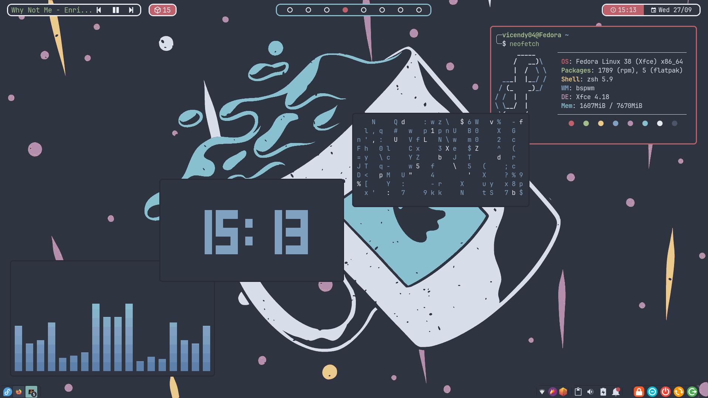
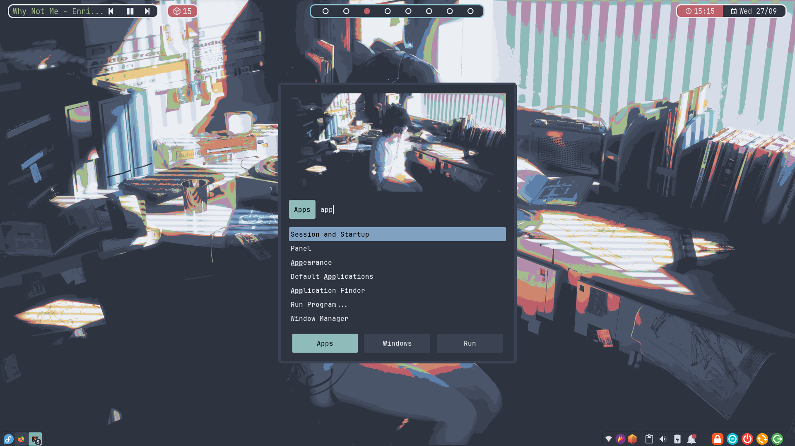

# Introduction

Welcome to my dotfiles repository, where I store my Linux rice configurations. This includes things to customize the desktop appearance, basic Vim configurations, and a guide for setting up a new system.

These dotfiles are simple and basic.

## Screenshot




## System Information

|      What's           | I use         |
| :-------------------: | :-----------: |
| Distro                | Fedora        |
| Window Manager        | bspwm         |
| Desktop Environment   | xfce          |
| Apps Laucher          | rofi          |
| Bar                   | polybar       |
| Terminal              | alacritty     |
| Shell                 | zsh           |
| Text Editor           | Nvim          |
| Compositor            | yshui-picom   |
| Music Player          | mpd + ncmpcpp |
| File Manager          | Thunar        |
| Capture Software      | Flameshot     |

## Appearance

- Theme: [Nordic](https://github.com/EliverLara/Nordic)
- Terminal Font: [JetBrains Nerd Font](https://github.com/ryanoasis/nerd-fonts)
- Icon: [Papirus](https://github.com/PapirusDevelopmentTeam/papirus-icon-theme)
- Cursor: [Nordzy-cursors](https://www.pling.com/p/1571937/)

## Some notes

<details>
<summary>Touchpad tap-to-click & Natural Scrolling</summary>

`/etc/X11/xorg.conf.d/40-touchpad.conf`

```
Section "InputClass"
    Identifier "touchpad"
    Driver "libinput"
    MatchIsTouchpad "on"
    Option "Tapping" "on"
    Option "TappingButtonMap" "lrm"
    Option "NaturalScrolling" "on"
EndSection
```
</details>
