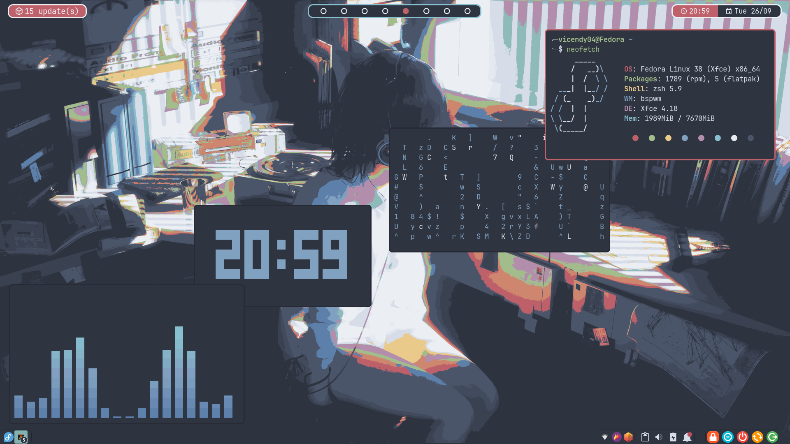

# Dotfiles

Welcome to my dotfiles repository, where I store my Linux rice configurations. This includes things to customize the desktop appearance, basic Vim configurations, and a guide for setting up a new system.

These dotfiles are simple and basic.

## Screenshot

## System Information

|      What's           | I use         |
| :-------------------: | :-----------: |
| Distro                | Fedora        |
| Window Manager        | bspwm         |
| Desktop Environment   | xfce()        |
| Apps Laucher          | rofi          |
| Bar                   | polybar       |
| Terminal              | alacritty     |
| Shell                 | zsh           |
| Text Editor           | Nvim          |
| Compositor            | yshui-picom   |
| Music Player          | mpd + ncmpcpp |
| File Manager          | Thunar        |
| Capture Software      | Flameshot     |

